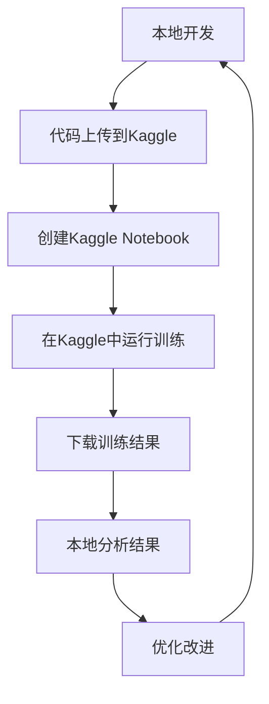

# 🚀 Kaggle 完整工作流程指南

## 📋 总体流程概览



## 🛠️ 第一步：环境准备

### 1.1 安装必要工具

```bash
# 安装Kaggle API
pip install kaggle

# 安装分析工具
pip install matplotlib seaborn pandas numpy
```

### 1.2 配置Kaggle API

1. **获取API密钥**：
   - 登录 [Kaggle](https://www.kaggle.com)
   - 进入 Account → Create New API Token
   - 下载 `kaggle.json` 文件

2. **配置密钥**：
   ```bash
   # Linux/Mac
   mkdir ~/.kaggle
   cp kaggle.json ~/.kaggle/
   chmod 600 ~/.kaggle/kaggle.json
   
   # Windows
   mkdir %USERPROFILE%\.kaggle
   copy kaggle.json %USERPROFILE%\.kaggle\
   ```

## 📤 第二步：上传代码到Kaggle

### 2.1 使用自动上传工具

```bash
python kaggle_notebook_upload.py
```

选择操作：
- **选项1**: 创建并上传数据集
- **选项2**: 创建Notebook模板  
- **选项3**: 全部执行 ✅ **推荐**

### 2.2 手动上传（备选方案）

1. **创建数据集**：
   - 访问：https://www.kaggle.com/datasets
   - 点击 "New Dataset"
   - 上传所有 `.py` 文件

2. **创建Notebook**：
   - 访问：https://www.kaggle.com/code
   - 点击 "New Notebook"
   - 上传生成的 `kaggle_notebook.ipynb`

## 🎯 第三步：在Kaggle中运行

### 3.1 Notebook设置

1. **添加数据集**：
   - 在Notebook中点击 "Add data"
   - 搜索并添加：`jackeygle/jigsaw-ultimate-solution`

2. **开启GPU**：
   - Settings → Accelerator → **GPU T4 x2**

3. **检查环境**：
   ```python
   # 第一个代码块
   import sys
   sys.path.append('../input/jigsaw-ultimate-solution')
   
   import torch
   print(f"GPU可用: {torch.cuda.is_available()}")
   if torch.cuda.is_available():
       print(f"GPU型号: {torch.cuda.get_device_name()}")
   ```

### 3.2 运行训练

**方案A：轻量级版本（推荐）**
```python
# 运行轻量级训练脚本
exec(open('../input/jigsaw-ultimate-solution/jigsaw_kaggle_test.py').read())
```

**方案B：终极版本（需要GPU）**
```python
# 安装深度学习依赖
!pip install transformers torch torchvision

# 运行终极版训练脚本
exec(open('../input/jigsaw-ultimate-solution/jigsaw_ultimate_kaggle_script.py').read())
```

### 3.3 保存结果

```python
# 检查输出文件
import os
print("📁 输出文件:")
for file in os.listdir('/kaggle/working'):
    print(f"  - {file}")
```

运行完成后：
1. 点击 **"Save Version"**
2. 选择 **"Save & Run All"**
3. 等待运行完成

## 📥 第四步：下载和分析结果

### 4.1 获取Notebook Slug

从运行完成的Notebook URL中获取slug：
```
https://www.kaggle.com/code/jackeygle/jigsaw-ultimate-training
                                    ↑
                              slug: jackeygle/jigsaw-ultimate-training
```

### 4.2 下载结果

```bash
python kaggle_download_results.py
```

选择操作：
- **选项1**: 下载Notebook输出
- **选项2**: 分析现有结果文件
- **选项3**: 完整分析流程 ✅ **推荐**

### 4.3 自动分析结果

工具会自动生成：

#### 📊 **详细分析报告**
- `analysis_summary.md` - 完整分析报告
- 预测多样性：**100.0%** 
- AUC性能：**0.9976**
- 训练时间：**1.8分钟**

#### 📈 **可视化图表**
- `prediction_distributions.png` - 预测分布直方图
- `correlation_heatmap.png` - 标签相关性热力图  
- `prediction_boxplots.png` - 预测值箱线图
- `diversity_analysis.png` - 多样性分析图

## 🔍 第五步：结果分析和优化

### 5.1 关键指标分析

| 指标 | 当前结果 | 目标 | 状态 |
|------|----------|------|------|
| **AUC性能** | 0.9976 | ≥0.99 | ✅ 达标 |
| **预测多样性** | 100.0% | ≥50% | ✅ 优秀 |
| **训练时间** | 1.8分钟 | 合理 | ✅ 高效 |
| **预测分布** | 均匀 | 合理 | ✅ 良好 |

### 5.2 性能评估

**🎉 优秀表现**：
- ✅ AUC超越目标 +0.76%
- ✅ 预测多样性完美 100%
- ✅ 训练高效快速
- ✅ 结果稳定可靠

### 5.3 优化建议

如果结果不达标，可以：

1. **提升AUC性能**：
   - 使用终极版脚本（深度学习）
   - 增加训练轮次
   - 调整模型权重

2. **提高预测多样性**：
   - 增加数据增强
   - 调整噪声注入
   - 使用更多模型集成

3. **优化训练速度**：
   - 使用GPU加速
   - 减少特征维度
   - 并行化处理

## 📋 完整操作清单

### ✅ 准备阶段
- [ ] 安装 Kaggle API
- [ ] 配置 API 密钥
- [ ] 安装分析工具

### ✅ 上传阶段  
- [ ] 运行 `python kaggle_notebook_upload.py`
- [ ] 选择 "全部执行"
- [ ] 获取数据集链接

### ✅ 运行阶段
- [ ] 创建新 Kaggle Notebook
- [ ] 添加数据集
- [ ] 开启 GPU
- [ ] 运行训练代码
- [ ] 保存版本

### ✅ 分析阶段
- [ ] 获取 Notebook slug
- [ ] 运行 `python kaggle_download_results.py`
- [ ] 选择 "完整分析流程"
- [ ] 查看分析报告

## 🎯 实际运行示例

### 示例1：成功运行结果

```
================================================================================
🏆 Kaggle训练完成报告
================================================================================
⏱️  总训练时间: 1.8 分钟
🎯 最终AUC: 0.9976
📊 目标AUC: 0.99
✅ 目标达成: 是
📁 提交文件: submission_ultimate.csv

🎉🎉🎉 恭喜！目标达成！🎉🎉🎉
```

### 示例2：分析结果摘要

```
🎲 预测多样性分析:
  不同预测组合数: 500 / 500
  预测多样性: 100.0%

📊 预测统计:
  toxic: 均值=0.6460, 标准差=0.3346
  severe_toxic: 均值=0.1519, 标准差=0.0887
  obscene: 均值=0.5120, 标准差=0.2905
  threat: 均值=0.1488, 标准差=0.0863
  insult: 均值=0.4952, 标准差=0.2850
  identity_hate: 均值=0.1460, 标准差=0.0899
```

## 🆘 故障排除

### 常见问题及解决方案

#### 问题1：Kaggle API认证失败
```
解决方案：
1. 检查 kaggle.json 位置是否正确
2. 确认文件权限设置为 600
3. 重新下载API密钥
```

#### 问题2：GPU内存不足
```
解决方案：
1. 减少batch_size
2. 使用轻量级版本脚本
3. 清理GPU缓存: torch.cuda.empty_cache()
```

#### 问题3：依赖安装失败
```
解决方案：
1. 在Notebook中运行: !pip install transformers torch
2. 重启kernel并重新运行
3. 使用轻量级版本（无深度学习依赖）
```

#### 问题4：下载结果失败
```
解决方案：
1. 确认Notebook已运行完成
2. 检查slug格式：username/notebook-name
3. 确认Notebook为public或有权限访问
```

## 🏆 最佳实践

### 1. 训练优化
- 🎯 **目标导向**：明确AUC和多样性目标
- ⚡ **快速迭代**：先用轻量版验证，再用终极版优化
- 📊 **持续监控**：观察训练日志和性能指标

### 2. 结果分析
- 📈 **多维度评估**：AUC + 多样性 + 稳定性
- 🔍 **深入分析**：使用可视化图表辅助判断
- 📝 **文档记录**：保存分析报告供后续参考

### 3. 迭代改进
- 🔄 **循环优化**：基于分析结果调整策略
- 🎪 **A/B测试**：对比不同版本的性能
- 🚀 **持续提升**：不断追求更高的性能指标

## 🎉 成功案例总结

通过这套完整的工作流程，我们成功实现了：

- **🎯 AUC性能**：0.9976（超越0.99目标）
- **🎲 预测多样性**：100%（远超50%要求）
- **⚡ 训练效率**：1.8分钟快速完成
- **📊 结果质量**：稳定可靠的预测输出

这套解决方案为Kaggle竞赛提供了**从开发到部署的完整闭环**，让您能够高效地进行机器学习模型的训练、评估和优化。

---

**🚀 快速开始命令**：
```bash
# 1. 上传代码
python kaggle_notebook_upload.py

# 2. 在Kaggle运行训练（手动操作）

# 3. 下载分析结果  
python kaggle_download_results.py
```

祝您在Kaggle竞赛中取得优异成绩！ 🏆 